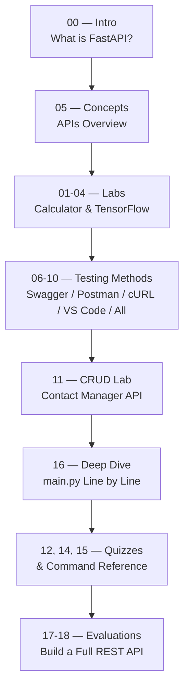
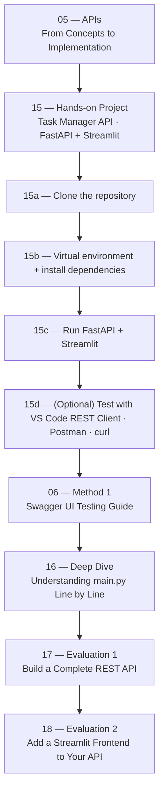

# FastAPI Course — Document Index

> Complete learning path for building APIs with FastAPI, Streamlit, TensorFlow and Flask.

---

## Documents

| # | File | Description |
|---|------|-------------|
| 00 | [What is FastAPI?](./00-What-is-FastAPI.md) | Introduces FastAPI, explains what the framework is, why it is used in ML/AI pipelines, and highlights its key advantages such as Swagger UI, automatic validation, and high performance. |
| 01 | [FastAPI — Calculator API with Swagger UI](./01-FastAPI-Calculator-API-with-Swagger-UI.md) | Builds a simple calculator REST API with FastAPI and tests it interactively via the Swagger UI interface. |
| 02 | [FastAPI — Calculator: Streamlit Frontend + FastAPI Backend](./02-FastAPI-Calculator-Frontend-Streamlit-Backend-FastAPI.md) | Connects a Streamlit web frontend to a FastAPI backend to create a full-stack calculator application. |
| 03 | [FastAPI — TensorFlow + Streamlit: Classification Model](./03-FastAPI-TensorFlow-Streamlit-Classification-Model.md) | Exposes a TensorFlow image classification model as a FastAPI endpoint consumed by a Streamlit interface. |
| 04 | [FastAPI — TensorFlow + Streamlit: Complete Guide](./04-FastAPI-TensorFlow-Streamlit-Complete-Guide.md) | Complete step-by-step project guide combining TensorFlow, FastAPI and Streamlit from setup to deployment. |
| 05 | [APIs — From Concepts to Implementation](./05-FastAPI-APIs-From-Concepts-to-Implementation.md) | Introduces API fundamentals (REST, HTTP methods, JSON) and walks through a full FastAPI implementation. |
| 06 | [Method 1 — Swagger UI Testing Guide](./06-FastAPI-Method-1-Swagger-UI-REST-Client-Practical-Testing-Guide.md) | Step-by-step guide to testing all Task Manager API endpoints directly from the Swagger UI interface. |
| 07 | [Method 2 — Postman Testing Guide](./07-FastAPI-Method-2-POSTMAN-REST-Client-Practical-Testing-Guide.md) | Step-by-step guide to testing all Task Manager API endpoints using the Postman desktop application. |
| 08 | [Method 3 — VS Code REST Client Testing Guide](./08-FastAPI-Method-3-VS-Code-REST-Client-Practical-Testing-Guide.md) | Step-by-step guide to testing all Task Manager API endpoints using the REST Client extension in VS Code. |
| 09 | [Method 4 — cURL Testing Guide](./09-FastAPI-Method-4-cURL-Guide-Contact-Manager-API.md) | Step-by-step guide to testing the Contact Manager API from the Linux terminal using cURL commands. |
| 10 | [Method 5 — Multiple Testing Methods Combined](./10-FastAPI-Method-5-Multiple-Testing-Methods-Guide-Contact-Manager-API.md) | Beginner-friendly guide covering all five testing methods for the Task Manager API in a single document. |
| 11 | [Lab — Build Your Own Contact Manager API (CRUD)](./11-FastAPI-Step-by-Step-CRUD-Lab-Contact-Manager-API.md) | Hands-on lab where students build a complete CRUD REST API for a Contact Manager from scratch using FastAPI. |
| 12 | [Quiz — APIs, FastAPI, Flask, requests & ML](./12-FastAPI-Quiz-APIs-Flask-Requests-and-ML.md) | Multiple-choice quiz covering APIs, FastAPI, Flask, the `requests` library and machine learning integrations. |
| 13 | [Commands Reference — FastAPI, Streamlit, Flask, TensorFlow](./13-FastAPI-Reference-Commands-FastAPI-Streamlit-Flask-TensorFlow.md) | Complete command reference for installing, running and managing Python AI/API projects on Windows, macOS and Linux. |
| 14 | [Quiz — Practical Labs: FastAPI, Streamlit & TensorFlow](./14-FastAPI-Practical-Quiz-Labs-Calculator-Streamlit-TensorFlow.md) | Quiz with A/B/C/D questions that tests understanding of the practical labs covered in files 01 to 04. |
| 15 | [Commands Reference (duplicate) + Calculator Quiz](./15-FastAPI-Calculator-Practical-Quiz-Labs-and-Command-Reference.md) | Extended command reference combined with practical quiz labs for the calculator and TensorFlow projects. |
| 16 | [Understanding `main.py` — Line by Line](./16-FastAPI-main-py-Explained-Line-by-Line.md) | Deep-dive explanation of every single line of a FastAPI `main.py` file, written for absolute beginners. |
| 17 | [Evaluation 1 — Build a Complete REST API](./17-FastAPI-Evaluation-1-Build-a-Complete-REST-API.md) | Final evaluation where students independently build a complete REST API with FastAPI from scratch. |
| 18 | [Evaluation 2 — Build a Streamlit Frontend for Your API](./18-FastAPI-Evaluation-2-Build-a-Complete-REST-API.md) | Continuation of Evaluation 1 where students add a Streamlit frontend that communicates with their FastAPI backend. |

---

## Learning Path

> **Open the file for each step:**
> - **00** → [What is FastAPI?](./00-What-is-FastAPI.md)
> - **05** → [APIs — From Concepts to Implementation](./05-FastAPI-APIs-From-Concepts-to-Implementation.md)
> - **01–04** → [01](./01-FastAPI-Calculator-API-with-Swagger-UI.md) · [02](./02-FastAPI-Calculator-Frontend-Streamlit-Backend-FastAPI.md) · [03](./03-FastAPI-TensorFlow-Streamlit-Classification-Model.md) · [04](./04-FastAPI-TensorFlow-Streamlit-Complete-Guide.md)
> - **06–10** → [06](./06-FastAPI-Method-1-Swagger-UI-REST-Client-Practical-Testing-Guide.md) · [07](./07-FastAPI-Method-2-POSTMAN-REST-Client-Practical-Testing-Guide.md) · [08](./08-FastAPI-Method-3-VS-Code-REST-Client-Practical-Testing-Guide.md) · [09](./09-FastAPI-Method-4-cURL-Guide-Contact-Manager-API.md) · [10](./10-FastAPI-Method-5-Multiple-Testing-Methods-Guide-Contact-Manager-API.md)
> - **11** → [Lab — Contact Manager API](./11-FastAPI-Step-by-Step-CRUD-Lab-Contact-Manager-API.md)
> - **16** → [Understanding main.py — Line by Line](./16-FastAPI-main-py-Explained-Line-by-Line.md)
> - **12, 14, 15** → [12](./12-FastAPI-Quiz-APIs-Flask-Requests-and-ML.md) · [14](./14-FastAPI-Practical-Quiz-Labs-Calculator-Streamlit-TensorFlow.md) · [15](./15-FastAPI-Calculator-Practical-Quiz-Labs-and-Command-Reference.md)
> - **17–18** → [Evaluation 1](./17-FastAPI-Evaluation-1-Build-a-Complete-REST-API.md) · [Evaluation 2](./18-FastAPI-Evaluation-2-Build-a-Complete-REST-API.md)

---

## ⚡ Fast Track — Already know the basics?

> **Skip straight to 05**, then follow this accelerated path:

> **Open the file for each step:**
> - **05** → [APIs — From Concepts to Implementation](./05-FastAPI-APIs-From-Concepts-to-Implementation.md)
> - **15** → [Hands-on Project — Task Manager API](./15-FastAPI-Calculator-Practical-Quiz-Labs-and-Command-Reference.md)
> - **15d** → [VS Code REST Client](./08-FastAPI-Method-3-VS-Code-REST-Client-Practical-Testing-Guide.md) · [Postman](./07-FastAPI-Method-2-POSTMAN-REST-Client-Practical-Testing-Guide.md) · [cURL](./09-FastAPI-Method-4-cURL-Guide-Contact-Manager-API.md)
> - **06** → [Method 1 — Swagger UI Testing Guide](./06-FastAPI-Method-1-Swagger-UI-REST-Client-Practical-Testing-Guide.md)
> - **16** → [Understanding main.py — Line by Line](./16-FastAPI-main-py-Explained-Line-by-Line.md)
> - **17** → [Evaluation 1 — Build a Complete REST API](./17-FastAPI-Evaluation-1-Build-a-Complete-REST-API.md)
> - **18** → [Evaluation 2 — Add a Streamlit Frontend](./18-FastAPI-Evaluation-2-Build-a-Complete-REST-API.md)

---

## Tech Stack

- **FastAPI** — Python web framework for building REST APIs
- **Streamlit** — Python library for building interactive web UIs
- **TensorFlow** — Machine learning framework for classification models
- **Flask** — Lightweight Python web framework
- **Swagger UI / Postman / cURL / VS Code REST Client** — API testing tools
