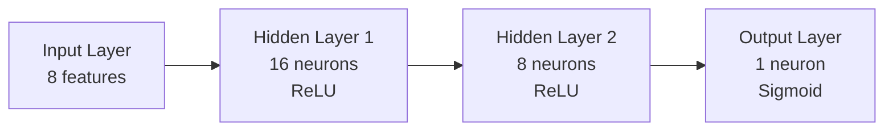
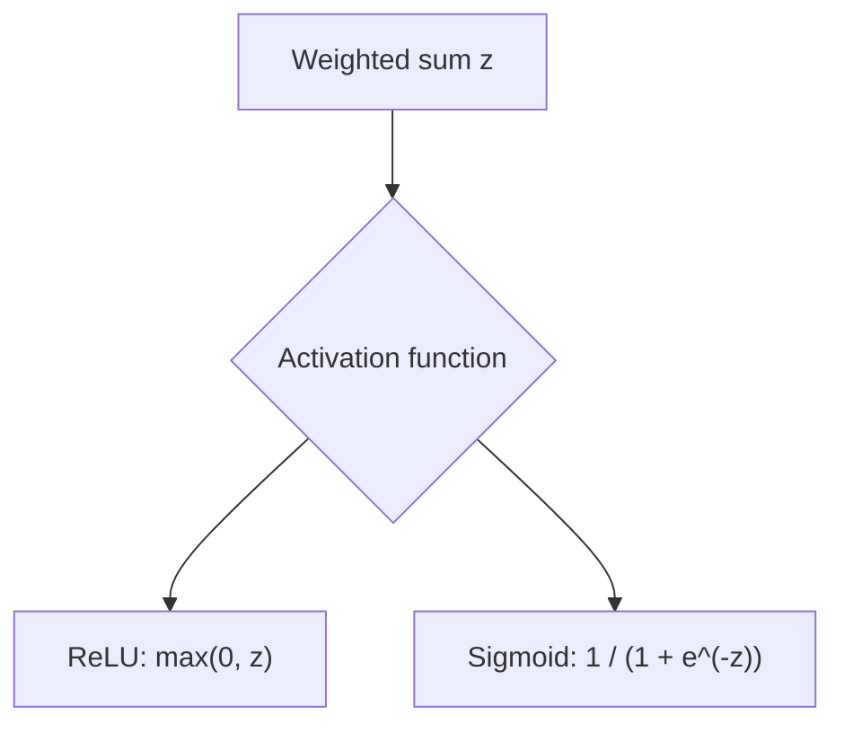
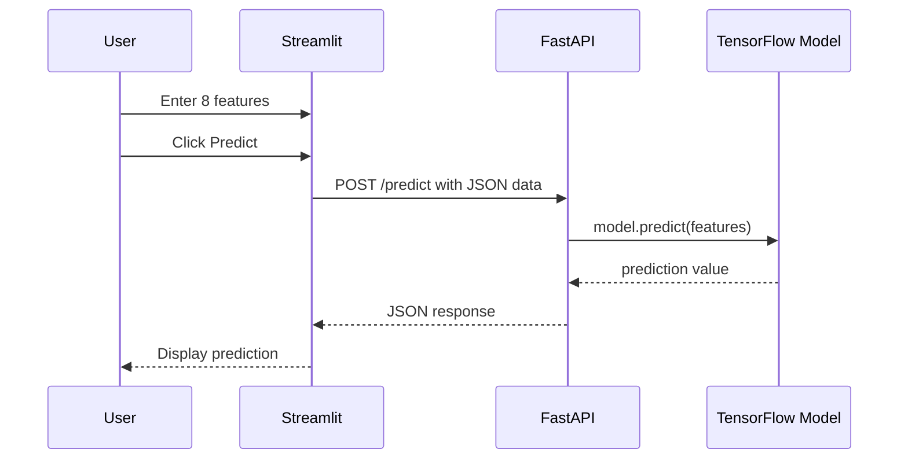
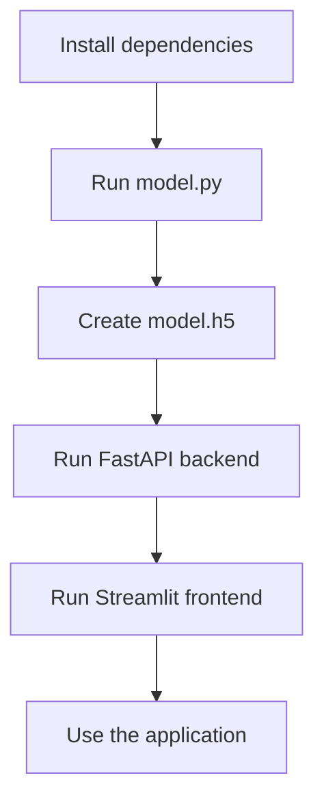

# Simple Project Using TensorFlow, FastAPI, and Streamlit

<details> 

<summary>Project Summary</summary>

<br/>
This project demonstrates a simple end-to-end machine learning application using:

- **TensorFlow** to train a binary classification model
- **FastAPI** to expose the trained model through a REST API
- **Streamlit** to build a lightweight frontend interface

The user enters 8 numeric features in the Streamlit interface, the frontend sends them to the FastAPI backend, and the backend returns a prediction generated by the TensorFlow model.

</details>


# 1 - Project Goal
<details>
<summary>Project Goal Overview</summary>
<br/>
The goal of this project is to show how a machine learning model can be:

1. **trained locally** with TensorFlow,
2. **saved to disk**,
3. **loaded inside a backend API**,
4. **used by a frontend application** for real-time prediction.

This is a small but complete example of an AI-powered application with a clear separation between:

- **model training**
- **backend inference**
- **frontend interaction**

</details>


# 2 - Global Architecture

<details>
<summary>Global Architecture Overview</summary>

<br/>

```mermaid
flowchart LR
    A["User enters 8 features<br/>in Streamlit"] --> B["Frontend sends<br/>HTTP POST request"]
    B --> C["FastAPI backend receives<br/>JSON data"]
    C --> D["TensorFlow model<br/>processes input"]
    D --> E["Prediction returned<br/>by API"]
    E --> F["Streamlit displays<br/>the result"]
````

This section explains the overall architecture of the project in a simple and progressive way. The purpose is to help beginners understand how the different parts of the application are connected and how data moves from the user interface to the machine learning model and back to the screen.

Even though this is a small project, it follows the same general idea used in many real-world AI applications. Instead of putting everything in one single file, the application is separated into different parts, and each part has a clear responsibility. This makes the project easier to understand, easier to maintain, and easier to improve later.

In this project, the architecture is divided into **three main layers**:

* the **model layer**, which is responsible for machine learning
* the **backend layer**, which is responsible for communication and prediction requests
* the **frontend layer**, which is responsible for user interaction

These three layers work together to create a complete end-to-end AI application.


## 1. Understanding the big picture

Before looking at each file, it is important to understand the general idea of the project.

The user does not interact directly with the TensorFlow model. Instead, the user interacts with a simple interface created with Streamlit. This interface collects the input values and sends them to the backend. The backend, built with FastAPI, receives these values, sends them to the TensorFlow model, gets the prediction, and returns the result to the frontend. Finally, the frontend displays the result to the user.

So, the data follows this path:

1. the user enters values in the Streamlit interface
2. Streamlit sends the data to FastAPI
3. FastAPI prepares the data and gives it to the TensorFlow model
4. the TensorFlow model makes a prediction
5. FastAPI returns the result
6. Streamlit displays the result

This flow is very important because it shows the role of each technology:

* **Streamlit** is used to build the user interface
* **FastAPI** is used to create the API
* **TensorFlow** is used to define and run the machine learning model


## 2. The model layer

The model layer is the part of the project that handles machine learning.

In this project, the file `model.py` is responsible for:

* generating sample training data
* building the TensorFlow model
* training the model
* saving the trained model to a file named `model.h5`

### Why do we need this file?

A machine learning model must first be trained before it can make predictions. Training means showing examples to the model so that it can learn patterns from the data.

In a real project, the training data would usually come from a CSV file, a database, or another source of real data. In this beginner project, sample data is generated directly in Python to keep the example simple.

### What happens in `model.py`?

The file `model.py` usually performs the following steps:

1. create input data and target labels
2. define the neural network architecture
3. compile the model
4. train the model on the data
5. save the trained model to disk

### Why is the model saved?

After training, the model is saved as a file, usually `model.h5`. This is very useful because the backend does not need to train the model every time the application runs. Instead, it can simply load the saved model and use it immediately for prediction.

This separation is important:

* `model.py` is mainly for **training**
* `backend.py` is mainly for **inference**

### Training vs inference

For beginners, these two words are very important:

* **training** means teaching the model using data
* **inference** means using the trained model to make a prediction on new data

In this project:

* training happens first, usually once or only when needed
* inference happens later, every time the user submits input values


## 3. The backend layer

The backend layer is the central part of the application. It acts as a bridge between the frontend and the machine learning model.

In this project, the file `backend.py` is responsible for:

* loading the trained model from `model.h5`
* creating an API with FastAPI
* receiving input data from the frontend
* validating and transforming the data
* sending the data to the TensorFlow model
* returning the prediction result as JSON

### Why do we need a backend?

A beginner might ask: why not call the model directly from Streamlit?

The answer is that using a backend is a much cleaner and more realistic design. The backend allows the machine learning logic to be isolated from the user interface. This has several advantages:

* the model can be reused by other applications
* the frontend stays simple
* the code is better organized
* the project becomes closer to a production-style architecture

### What is an API?

An **API** is a way for one program to communicate with another program.

In this project:

* Streamlit sends a request to FastAPI
* FastAPI receives the request
* FastAPI processes the data and returns a response

This communication usually happens through HTTP.

### What is an HTTP POST request?

An HTTP POST request is a type of request used to send data to a server.

In this project, the frontend sends the 8 numeric values to the backend using an HTTP POST request. The backend receives these values and uses them for prediction.

### What is JSON?

The data exchanged between the frontend and the backend is usually sent in **JSON** format.

JSON is a lightweight text format used to structure data. It is easy to read and very common in web applications and APIs.

For example, the frontend could send data like this:

```json
{
  "features": [1.2, 3.4, 5.6, 7.8, 0.9, 2.1, 4.3, 6.5]
}
```

The backend reads this JSON data, converts it into a NumPy array, and passes it to the TensorFlow model.

### Why convert the data?

Machine learning models do not work directly with raw JSON text. They need numerical arrays with the right shape.

That is why the backend prepares the data before prediction. This step may include:

* converting the list into a NumPy array
* reshaping the array
* making sure the values are numeric
* making sure the model receives the expected format

This step is very important because machine learning models are sensitive to input format.


## 4. The frontend layer

The frontend layer is the visible part of the project. It is the part that the user sees and interacts with.

In this project, the file `frontend.py` is responsible for:

* displaying the interface with Streamlit
* allowing the user to enter 8 numeric values
* sending the values to the backend
* receiving the prediction result
* displaying the result clearly on the screen

### Why use Streamlit?

Streamlit is a Python framework that makes it easy to build simple web interfaces for data science and machine learning projects.

It is especially useful for beginners because:

* it is easy to learn
* it requires very little code
* it works well with Python
* it is ideal for demos and prototypes

### What does the user do in the frontend?

The user enters 8 numeric values. These values represent the input features used by the machine learning model.

A **feature** is simply an input variable used by the model to make a prediction.

For example, in another type of project, features could represent:

* age
* salary
* number of purchases
* temperature
* sensor measurements

In this project, the features are generic numeric values used to demonstrate the full prediction workflow.

### What happens after the user clicks the prediction button?

Once the values are entered, the frontend sends them to the backend. It does not calculate the prediction itself. Its role is only to collect input and display output.

This is important for beginners to understand:

* the frontend is not the model
* the frontend is not the API
* the frontend is the interface used to interact with the system


## 5. How all layers work together

Now let us connect everything step by step.

### Step 1: the user enters data

The process starts when the user types 8 numeric values into the Streamlit interface.

These values are the input of the machine learning system.

### Step 2: the frontend sends the request

When the user submits the form, Streamlit sends the data to the FastAPI backend using an HTTP POST request.

The data is usually sent in JSON format.

### Step 3: the backend receives and prepares the data

FastAPI receives the request and extracts the values.

Then, the backend converts the data into the format expected by TensorFlow. This often means creating a NumPy array and reshaping it correctly.

### Step 4: the model makes a prediction

The backend passes the prepared input to the trained TensorFlow model.

The model performs inference and generates a prediction.

Depending on the project, this prediction could be:

* a class such as 0 or 1
* a probability such as 0.87
* a label such as "positive" or "negative"

### Step 5: the backend returns the result

Once the prediction is available, the backend sends the result back to the frontend in JSON format.

### Step 6: the frontend displays the result

Finally, Streamlit receives the response and shows the prediction to the user in a simple way.

This completes one full prediction cycle.


## 6. Why this architecture is useful

This architecture is useful because it separates the project into clear and independent parts.

### Clear separation of responsibilities

Each component has one main responsibility:

* **TensorFlow** handles the machine learning logic
* **FastAPI** handles communication and prediction requests
* **Streamlit** handles the user interface

This makes the project easier to understand because each file has a clear purpose.

### Easier maintenance

If you want to improve the model, you can modify `model.py` without changing the frontend.

If you want to change the user interface, you can modify `frontend.py` without changing the model logic.

If you want to add validation or new API routes, you can modify `backend.py`.

This separation makes maintenance easier.

### Better scalability

Even though this is a simple beginner project, the structure can grow into a more advanced system.

For example, later you could:

* replace the sample data with real data
* train a better model
* deploy the backend on a cloud server
* improve the Streamlit interface
* add authentication
* connect a database

Because the project is already separated into layers, these improvements become easier to implement.

---

## 7. Beginner-friendly analogy

A simple way to understand the architecture is to compare it to a restaurant:

* the **frontend** is the waiter who takes your order
* the **backend** is the kitchen manager who receives the order and sends it to the right place
* the **model** is the cook who prepares the final result

The user talks to the waiter, not directly to the cook.

In the same way, the user interacts with Streamlit, not directly with TensorFlow.

The backend is the middle layer that connects everything.

This analogy helps explain why different parts of the application have different roles.


## 8. Final idea to remember

The most important thing to remember is that this project is not only about training a model. It is about showing how a machine learning model can become part of a complete application.

This is why the architecture matters.

The project teaches three essential ideas:

1. a model can be trained and saved
2. a backend can load the model and expose it through an API
3. a frontend can send user input and display the prediction

Together, these ideas form the foundation of many modern AI applications.

</details>


# 3 - Project Structure

```text
.
├── backend.py
├── frontend.py
├── model.py
├── README.md
└── requirements.txt
```

<details>
<summary><strong>Role of each file</strong></summary>

## `model.py`

Contains the machine learning logic:

* generates the data,
* defines the neural network,
* trains the model,
* saves the trained model.

## `backend.py`

Contains the FastAPI server:

* loads the trained model,
* defines the API endpoint `/predict`,
* performs inference.

## `frontend.py`

Contains the Streamlit interface:

* displays input fields,
* sends requests to the backend,
* shows the result.

## `requirements.txt`

Contains all Python dependencies needed to run the project.

## `README.md`

Explains the project, installation, architecture, and execution steps.

</details>

---

# 4 - Neural Network Explanation



<details>
<summary><strong>What is this neural network doing?</strong></summary>

This model is a **binary classification neural network**.

It receives **8 numeric input values** and produces **one output value between 0 and 1**.

* If the output is close to **0**, the model predicts class **0**
* If the output is close to **1**, the model predicts class **1**

This means the model is estimating the probability that the input belongs to the positive class.

</details>

<details>
<summary><strong>Explanation of each layer</strong></summary>

## Input layer

The model expects an input vector of size **8**, because each sample contains **8 features**.

Example:

```python
[0.2, 0.8, 0.1, 0.7, 0.9, 0.3, 0.5, 0.6]
```

## First hidden layer

```python
Dense(16, activation='relu', input_shape=(8,))
```

This layer:

* receives the 8 input values,
* computes weighted combinations,
* applies the **ReLU** activation function,
* produces 16 outputs.

## Second hidden layer

```python
Dense(8, activation='relu')
```

This layer:

* takes the 16 outputs of the previous layer,
* transforms them again,
* produces 8 new learned features.

## Output layer

```python
Dense(1, activation='sigmoid')
```

This layer:

* outputs a single value,
* uses **sigmoid** to map the result between **0 and 1**,
* gives the probability of belonging to class 1.

</details>

---

# 5 - Activation Functions



<details>
<summary><strong>Why do we use activation functions?</strong></summary>

Activation functions allow the neural network to learn **non-linear relationships**.

Without activation functions, the neural network would behave like a simple linear model, even if it had many layers.

</details>

<details>
<summary><strong>ReLU explanation</strong></summary>

## ReLU

ReLU stands for **Rectified Linear Unit**.

Formula:

```text
ReLU(x) = max(0, x)
```

This means:

* if the value is negative, the output becomes 0,
* if the value is positive, the output stays unchanged.

### Why ReLU is useful

* very simple and efficient,
* helps deep networks train faster,
* avoids some issues that happen with older activation functions.

</details>

<details>
<summary><strong>Sigmoid explanation</strong></summary>

## Sigmoid

The sigmoid activation function transforms a value into a number between **0 and 1**.

Formula:

```text
sigmoid(x) = 1 / (1 + e^(-x))
```

### Why sigmoid is useful here

Because this project is doing **binary classification**, the output should represent a probability.

Examples:

* output = 0.12 → likely class 0
* output = 0.87 → likely class 1

</details>

---

# 6 - Loss Function and Optimizer

<details>
<summary><strong>Model compilation details</strong></summary>

The model is compiled with:

```python
model.compile(
    optimizer='adam',
    loss='binary_crossentropy',
    metrics=['accuracy']
)
```

## Optimizer: Adam

Adam is a widely used optimization algorithm in deep learning.

Its role is to update the model weights during training in order to reduce the prediction error.

Why it is popular:

* efficient,
* works well in many practical cases,
* requires little manual tuning.

## Loss function: binary_crossentropy

This loss is used for **binary classification problems**.

It measures how far the predicted probability is from the true label.

If the model predicts a value close to the true class, the loss is low.
If the model predicts a wrong probability, the loss is high.

## Metric: accuracy

Accuracy measures how often the model predicts the correct class.

Example:

* if 90 predictions out of 100 are correct,
* the accuracy is 90%.

</details>

---

# 7 - Training Data Logic

<details>
<summary><strong>How the dummy dataset is created</strong></summary>

The training data is generated using:

```python
X = np.random.rand(1000, 8)
y = (X.sum(axis=1) > 4).astype(int)
```

## Explanation

### `X = np.random.rand(1000, 8)`

This creates:

* **1000 samples**
* **8 features per sample**
* each feature is a random number between 0 and 1

### `X.sum(axis=1) > 4`

For each row:

* the 8 values are summed,
* if the sum is greater than 4, the sample is labeled **1**,
* otherwise, it is labeled **0**.

This creates a simple classification rule.

### Why this is useful

This is not a real dataset, but it is useful for:

* testing the full ML pipeline,
* understanding the integration between training, backend, and frontend,
* building a first complete AI application.

</details>

---

# 8 - File `model.py`

```python
import tensorflow as tf
from tensorflow.keras.models import Sequential
from tensorflow.keras.layers import Dense
import numpy as np

# Generate dummy training data
def generate_data():
    X = np.random.rand(1000, 8)  # 1000 samples, 8 features
    y = (X.sum(axis=1) > 4).astype(int)  # 1 if the sum of the features > 4, otherwise 0
    return X, y

# Create and train a simple model
def train_model():
    X, y = generate_data()
    model = Sequential([
        Dense(16, activation='relu', input_shape=(8,)),
        Dense(8, activation='relu'),
        Dense(1, activation='sigmoid')
    ])
    model.compile(optimizer='adam', loss='binary_crossentropy', metrics=['accuracy'])
    model.fit(X, y, epochs=10)
    model.save('model.h5')

if __name__ == "__main__":
    train_model()
```

<details>
<summary><strong>Line-by-line explanation of <code>model.py</code></strong></summary>

## Imports

```python
import tensorflow as tf
from tensorflow.keras.models import Sequential
from tensorflow.keras.layers import Dense
import numpy as np
```

These imports are used to:

* build the neural network with TensorFlow/Keras,
* manipulate arrays with NumPy.

## Data generation function

```python
def generate_data():
    X = np.random.rand(1000, 8)
    y = (X.sum(axis=1) > 4).astype(int)
    return X, y
```

This function creates:

* the input matrix `X`,
* the target labels `y`.

## Training function

```python
def train_model():
```

This function groups all training steps.

```python
X, y = generate_data()
```

Loads the generated dataset.

```python
model = Sequential([
    Dense(16, activation='relu', input_shape=(8,)),
    Dense(8, activation='relu'),
    Dense(1, activation='sigmoid')
])
```

Defines the neural network architecture.

```python
model.compile(optimizer='adam', loss='binary_crossentropy', metrics=['accuracy'])
```

Prepares the model for training.

```python
model.fit(X, y, epochs=10)
```

Trains the model for 10 epochs.

```python
model.save('model.h5')
```

Saves the trained model to disk.

</details>

---

# 9 - File `backend.py`

```python
from fastapi import FastAPI
from pydantic import BaseModel
import tensorflow as tf
import numpy as np

# Load the trained model
model = tf.keras.models.load_model('model.h5')

# Define the structure of the input data
class PredictionInput(BaseModel):
    features: list

app = FastAPI()

@app.post("/predict")
def predict(input: PredictionInput):
    features = np.array(input.features).reshape(1, -1)
    prediction = model.predict(features)
    return {"prediction": float(prediction[0, 0])}
```

<details>
<summary><strong>Detailed explanation of <code>backend.py</code></strong></summary>

## Model loading

```python
model = tf.keras.models.load_model('model.h5')
```

This loads the model saved previously by `model.py`.

## Pydantic class

```python
class PredictionInput(BaseModel):
    features: list
```

This defines the expected JSON format.

Example request:

```json
{
  "features": [0.1, 0.2, 0.3, 0.4, 0.5, 0.6, 0.7, 0.8]
}
```

## FastAPI application

```python
app = FastAPI()
```

Creates the backend application.

## Prediction endpoint

```python
@app.post("/predict")
def predict(input: PredictionInput):
```

This defines a POST endpoint at:

```text
/predict
```

## Reshaping the input

```python
features = np.array(input.features).reshape(1, -1)
```

The model expects a 2D array:

* 1 row = 1 sample
* 8 columns = 8 features

## Model prediction

```python
prediction = model.predict(features)
```

This sends the input to the neural network.

## Returning JSON

```python
return {"prediction": float(prediction[0, 0])}
```

The output is converted into a Python float and returned as JSON.

</details>

---

# 10 - File `frontend.py`

```python
import streamlit as st
import requests

# FastAPI API URL
API_URL = "http://127.0.0.1:8000"

st.title("Prediction with TensorFlow, FastAPI and Streamlit")

features = [st.number_input(f"Feature {i+1}", format="%f") for i in range(8)]

if st.button("Predict"):
    response = requests.post(f"{API_URL}/predict", json={"features": features})
    if response.status_code == 200:
        prediction = response.json().get("prediction")
        st.success(f"The prediction is: {prediction}")
    else:
        st.error("Prediction error")
```

<details>
<summary><strong>Detailed explanation of <code>frontend.py</code></strong></summary>

## Streamlit import

```python
import streamlit as st
```

Used to create the user interface.

## Requests import

```python
import requests
```

Used to send HTTP requests to the FastAPI backend.

## API URL

```python
API_URL = "http://127.0.0.1:8000"
```

The frontend communicates with the backend running locally on port 8000.

## Title

```python
st.title("Prediction with TensorFlow, FastAPI and Streamlit")
```

Displays the application title.

## Input fields

```python
features = [st.number_input(f"Feature {i+1}", format="%f") for i in range(8)]
```

Creates 8 numeric input boxes.

## Prediction button

```python
if st.button("Predict"):
```

When the user clicks the button, the frontend sends the input data to the backend.

## POST request

```python
response = requests.post(f"{API_URL}/predict", json={"features": features})
```

The input is sent as JSON.

## Displaying result

```python
if response.status_code == 200:
    prediction = response.json().get("prediction")
    st.success(f"The prediction is: {prediction}")
else:
    st.error("Prediction error")
```

If the request is successful, the prediction is displayed.
Otherwise, an error message is shown.

</details>

---

# 11 - API Request / Response Flow



---

# 12 - `requirements.txt` File

```text
tensorflow
fastapi
uvicorn
pydantic
streamlit
requests
```

<details>
<summary><strong>Why each dependency is needed</strong></summary>

## `tensorflow`

Used to create, train, save, and load the neural network.

## `fastapi`

Used to build the backend API.

## `uvicorn`

Used to run the FastAPI application server.

## `pydantic`

Used by FastAPI for request validation.

## `streamlit`

Used to create the frontend interface.

## `requests`

Used by Streamlit to communicate with the backend API.

</details>

---

# 13 - Installation Steps

## 13.1 - Clone the repository

```bash
git clone https://github.com/hrhouma/fastapi-calculator-tensorflow-1.git
cd fastapi-calculator-tensorflow-1
```

## 13.2 - Create and activate a virtual environment

```bash
python -m venv myenv
```

### On Windows

```bash
myenv\Scripts\activate
```

### On macOS and Linux

```bash
source myenv/bin/activate
```

## 13.3 - Install dependencies

```bash
pip install -r requirements.txt
```

## 13.4 - Train the model

```bash
python model.py
```

## 13.5 - Start the backend

```bash
uvicorn backend:app --reload
```

## 13.6 - Start the frontend

```bash
streamlit run frontend.py
```

---

# 14 - Execution Order



<details>
<summary><strong>Why this order matters</strong></summary>

You must first run:

```bash
python model.py
```

because this creates the file:

```text
model.h5
```

Without this file, the backend cannot load the trained model and will fail at startup.

</details>

---

# 15 - Example JSON Input and Output

## Request

```json
{
  "features": [0.5, 0.8, 0.1, 0.6, 0.9, 0.4, 0.3, 0.7]
}
```

## Response

```json
{
  "prediction": 0.9123457670211792
}
```

<details>
<summary><strong>How to interpret the prediction</strong></summary>

The output is a probability between 0 and 1.

For example:

* `0.10` means the model is leaning toward class 0
* `0.90` means the model is leaning toward class 1

A common threshold is:

* prediction >= 0.5 → class 1
* prediction < 0.5 → class 0

</details>

---

# 16 - Important Notes

<details>
<summary><strong>Important technical remarks</strong></summary>

## Dummy dataset

This project uses an artificial dataset created with random values.
It is meant for learning and demonstration only.

## Local execution

The backend URL is:

```text
http://127.0.0.1:8000
```

This means the frontend and backend are expected to run on the same local machine.

## Saved model format

The model is saved as:

```text
model.h5
```

This is a classic Keras model format.

## No preprocessing validation

This project is intentionally simple.
In a production system, you would usually add:

* stricter input validation,
* error handling,
* logging,
* model versioning,
* security controls,
* preprocessing steps.

</details>

---

# 17 - Commands Summary

```bash
# Clone the repository
git clone https://github.com/hrhouma/fastapi-calculator-tensorflow-1.git
cd fastapi-calculator-tensorflow-1

# Create and activate a virtual environment
python -m venv myenv

# On Windows
myenv\Scripts\activate

# On macOS and Linux
source myenv/bin/activate

# Install dependencies
pip install -r requirements.txt

# Train and save the model
python model.py

# Start the FastAPI server
uvicorn backend:app --reload

# Run the Streamlit application
streamlit run frontend.py
```

---

# 18 - Possible Improvements

<details>
<summary><strong>Ideas to improve the project</strong></summary>

You can improve this project by adding:

* real dataset loading from CSV,
* better input validation,
* a threshold-based class label,
* Docker support,
* a `/health` endpoint,
* a model evaluation report,
* charts in Streamlit,
* confidence display,
* error handling for invalid inputs,
* multi-class classification,
* database logging of predictions.

</details>

---

# 19 - Conclusion

This project is a simple but effective introduction to:

* machine learning with TensorFlow,
* backend API development with FastAPI,
* frontend interaction with Streamlit,
* end-to-end deployment logic for AI applications.

It is especially useful for understanding how a trained model can move from a Python training script into a real application that accepts user input and returns live predictions.


