<a id="top"></a>

# FastAPI — Learning Path, API Testing, and Project Roadmap

<p align="center">
  <a href="https://github.com/inskillflow/FastAPI-EN"></a>
  <a href="https://github.com/inskillflow/demo_api_1_simple_fastapi_app"></a>
  <a href="https://github.com/inskillflow/iris-ai-platform"></a>
</p>

<p align="center">
  A structured, hands-on, and project-oriented roadmap for learning FastAPI, mastering API testing, and building your own backend and front-end step by step.
</p>

---

## Table of Contents

| #   | Section                                                                                                      |
| --- | ------------------------------------------------------------------------------------------------------------ |
| 1   | [Overview](#section-1)                                                                                       |
| 2   | [Important Before You Start](#section-2)                                                                     |
| 3   | [Main Repository](#section-3)                                                                                |
| 4   | [Step 1 — Understand FastAPI](#section-4)                                                                    |
| 5   | [Step 2 — Review a Simple Example](#section-5)                                                               |
| 6   | [Step 3 — Read the Main Document](#section-6)                                                                |
| 6a  | &nbsp;&nbsp;&nbsp;↳ [Short on time? Jump to the hands-on project](#section-6)                               |
| 7   | [Step 4 — Learn How to Test an API](#section-7)                                                              |
| 8   | [Step 5 — Complete Testing Guide](#section-8)                                                                |
| 8a  | &nbsp;&nbsp;&nbsp;↳ [Other optional testing methods](#section-8)                                             |
| 9   | [Step 6 — Practice Quiz](#section-9)                                                                         |
| 10  | [Step 7 — Understand `main.py` Line by Line](#section-10)                                                    |
| 11  | [Step 8 — Evaluation 2: Build Your Own API](#section-11)                                                     |
| 12  | [Step 9 — Analyze the Front-End of the Demo Project](#section-12)                                            |
| 13  | [Step 10 — Evaluation 3: Build the Front-End for Your API](#section-13)                                      |
| 14  | [Step 11 — Next Project](#section-14)                                                                        |
| 15  | [Evaluations Overview](#section-15)                                                                          |
| 16  | [Recommended Workflow](#section-16)                                                                          |
| 17  | [Visual Roadmap](#section-17)                                                                                |
| 18  | [Conclusion](#section-18)                                                                                    |

---

<a id="section-1"></a>

## 1) Overview

This roadmap is designed to guide you through a complete and practical FastAPI learning sequence.

You will progressively move through the following stages:

- understanding the framework,
- exploring a simple API example,
- learning how to test APIs properly,
- practicing through a quiz,
- analyzing a real FastAPI project,
- building your own API,
- creating its front-end,
- and continuing with a larger project afterward.

### Global Learning Flow

```mermaid id="p6g8r1"
flowchart LR
    A["Understand FastAPI"] --> B["Study a Simple Example"]
    B --> C["Read the Main Document"]
    C --> D["Learn API Testing"]
    D --> E["Practice with Quiz"]
    E --> F["Understand main.py"]
    F --> G["Build Your Own API"]
    G --> H["Build the Front-End"]
    H --> I["Continue to Iris AI Platform"]
````

<p align="right"><a href="#top">↑ Back to top</a></p>

---

<a id="section-2"></a>

## 2) Important Before You Start

> [!IMPORTANT]
> This roadmap is built around **progressive understanding through practice**.
>
> It is strongly recommended to:
>
> * read the materials in order,
> * study the demo project carefully,
> * reuse existing patterns intelligently,
> * and avoid starting from scratch when a strong reference already exists.
>
> The goal is to **understand, adapt, build, and deliver**.

> [!TIP]
> Read the full conceptual document first whenever possible.
> If time is limited, jump directly to the hands-on project and learn by analyzing the implementation.

### Recommended Mindset

```mermaid id="n2x4t8"
flowchart TD
    A["Read"] --> B["Understand"]
    B --> C["Analyze"]
    C --> D["Reuse Patterns"]
    D --> E["Adapt"]
    E --> F["Build"]
    F --> G["Test"]
    G --> H["Deliver"]
```

<p align="right"><a href="#top">↑ Back to top</a></p>

---

<a id="section-3"></a>

## 3) Main Repository

Start with the main repository:

[FastAPI-EN — Complete Repository](https://github.com/inskillflow/FastAPI-EN)

This repository contains the learning materials, practical examples, testing guides, and project-oriented resources used throughout this roadmap.

<p align="right"><a href="#top">↑ Back to top</a></p>

---

<a id="section-4"></a>

## 4) Step 1 — Understand FastAPI

Begin with this introductory document:

[00 — What is FastAPI](https://github.com/inskillflow/FastAPI-EN/blob/main/00-What-is-FastAPI.md)

This document establishes the foundation:

* what FastAPI is,
* why it is useful,
* how it simplifies API development,
* and why it is well suited for modern backend systems.

### Core Idea of FastAPI

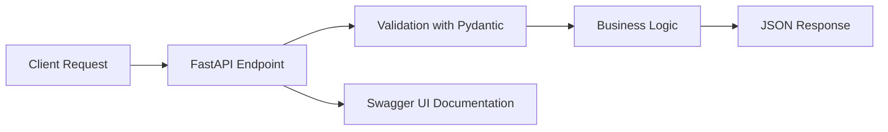

<p align="right"><a href="#top">↑ Back to top</a></p>

---

<a id="section-5"></a>

## 5) Step 2 — Review a Simple Example

Continue with this simple calculator API example:

[01 — FastAPI Calculator API with Swagger UI](https://github.com/inskillflow/FastAPI-EN/blob/main/01-FastAPI-Calculator-API-with-Swagger-UI.md)

This example is useful for understanding:

* the structure of a small FastAPI application,
* how endpoints are defined,
* how the application runs,
* and how Swagger UI is used for testing.

### Simple Example Architecture

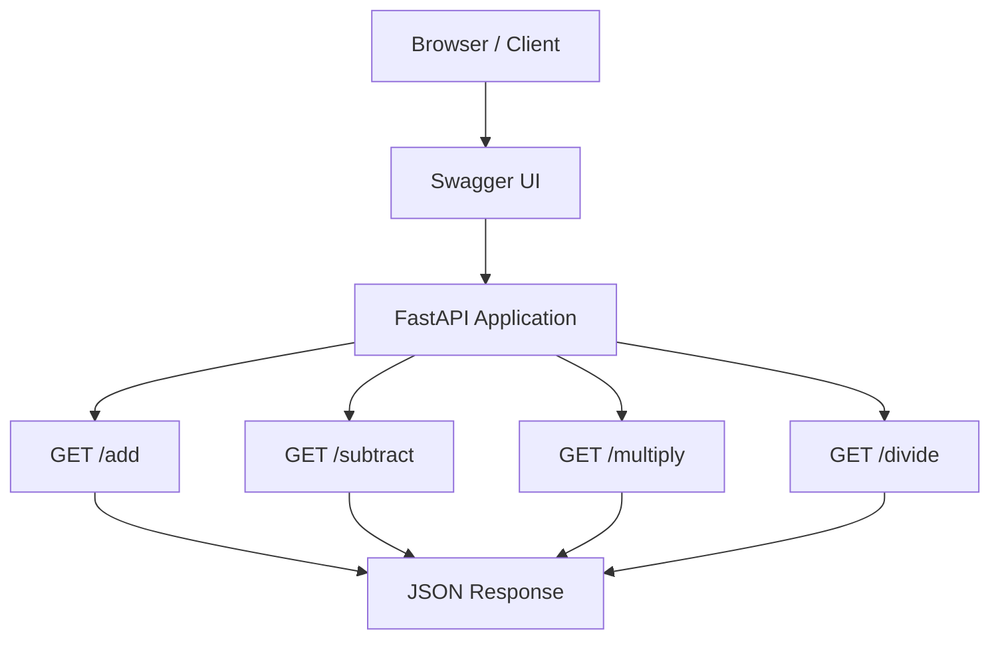

<p align="right"><a href="#top">↑ Back to top</a></p>

---

<a id="section-6"></a>

## 6) Step 3 — Read the Main Document

It is strongly recommended to read the following document completely:

[05 — FastAPI APIs: From Concepts to Implementation](https://github.com/inskillflow/FastAPI-EN/blob/main/05-FastAPI-APIs-From-Concepts-to-Implementation.md)

This is one of the most important resources in the sequence because it connects theory, design logic, and implementation.

### Short on time? Jump to the hands-on project

Go directly to **Point 15**:

**15 — Hands-on Project — Task Manager API (FastAPI + Streamlit)**

Clone the project with:

```bash
git clone https://github.com/inskillflow/demo_api_1_simple_fastapi_app.git
```

### From Theory to Practice

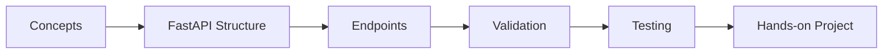

<p align="right"><a href="#top">↑ Back to top</a></p>

---

<a id="section-7"></a>

## 7) Step 4 — Learn How to Test an API

To understand how to test an API step by step, read:

[16 — How to Test Your API with Swagger UI — Step by Step for Absolute Beginners](https://github.com/inskillflow/FastAPI-EN/blob/main/16-FastAPI-main-py-Explained-Line-by-Line.md)

This resource helps clarify the practical testing process:

* open Swagger UI,
* choose an endpoint,
* provide input values,
* execute the request,
* inspect the response,
* and understand what the API returns.

### Swagger UI Testing Flow

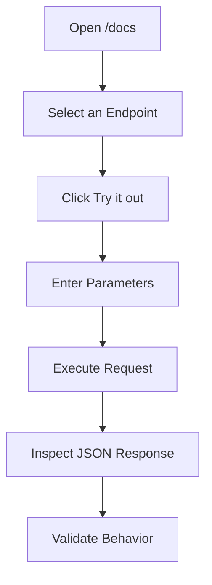

<p align="right"><a href="#top">↑ Back to top</a></p>

---

<a id="section-8"></a>

## 8) Step 5 — Complete Testing Guide

For more complete testing, use this guide:

[06 — FastAPI Method 1: Swagger UI + REST Client — Practical Testing Guide](https://github.com/inskillflow/FastAPI-EN/blob/main/06-FastAPI-Method-1-Swagger-UI-REST-Client-Practical-Testing-Guide.md)

This document is important for learning how to test APIs in a more structured and disciplined way.

### Other optional testing methods

Documents **07, 08, 09, and 10** introduce additional testing approaches:

* `curl`
* **REST Client** in VS Code
* **Postman**

You may use the method that best fits your workflow.

> [!NOTE]
> The testing tool can change.
> The real objective is to understand requests, responses, status codes, parameters, and testing logic.

### API Testing Ecosystem

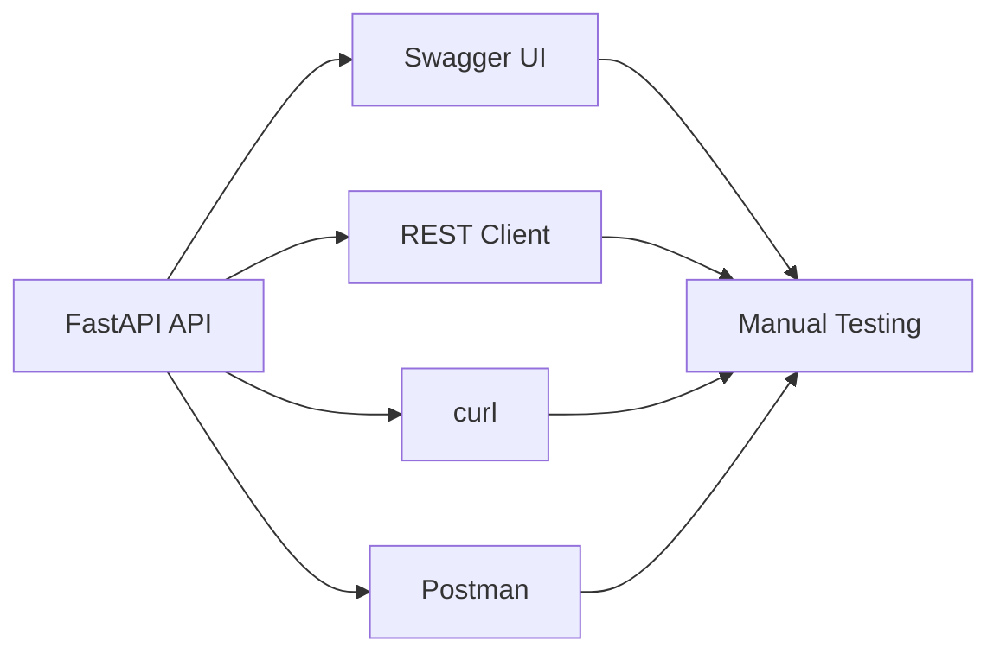

<p align="right"><a href="#top">↑ Back to top</a></p>

---

<a id="section-9"></a>

## 9) Step 6 — Practice Quiz

Practice with this quiz:

[01 — Quiz: API Testing with FastAPI](https://github.com/inskillflow/demo_api_1_simple_fastapi_app/blob/main/01-Quiz-API-Testing-with-FastAPI.md)

Answer key:

[02 — Answers: Quiz API Testing with FastAPI](https://github.com/inskillflow/demo_api_1_simple_fastapi_app/blob/main/02-Answers-Quiz-API-Testing-with-FastAPI.md)

This quiz is useful for checking your understanding before moving into project work.

<p align="right"><a href="#top">↑ Back to top</a></p>

---

<a id="section-10"></a>

## 10) Step 7 — Understand `main.py` Line by Line

To understand how a FastAPI application is built in detail, read:

[16 — FastAPI main.py Explained Line by Line](https://github.com/inskillflow/FastAPI-EN/blob/main/16-FastAPI-main-py-Explained-Line-by-Line.md)

This document is especially useful for understanding:

* `Pydantic`,
* route definitions,
* request handling,
* response structure,
* and the internal organization of a FastAPI project.

### Internal Structure of a FastAPI App

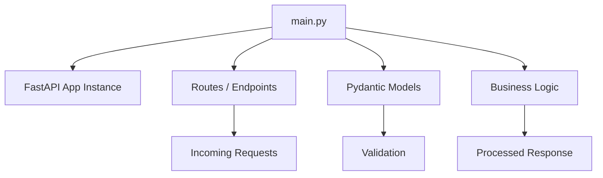

<p align="right"><a href="#top">↑ Back to top</a></p>

---

<a id="section-11"></a>

## 11) Step 8 — Evaluation 2: Build Your Own API

It is now time to build your own API.

Instructions:

[06 — FastAPI Method 1: Swagger UI + REST Client — Practical Testing Guide](https://github.com/inskillflow/FastAPI-EN/blob/main/06-FastAPI-Method-1-Swagger-UI-REST-Client-Practical-Testing-Guide.md)

Use the analyzed project as inspiration and adapt it intelligently.

Examples of possible changes:

* change the domain,
* modify the resource names,
* redesign the endpoints,
* update the logic,
* adapt the project to a different context.

### Reference project

[demo_api_1_simple_fastapi_app](https://github.com/inskillflow/demo_api_1_simple_fastapi_app/tree/main)

> [!TIP]
> Do not waste time trying to invent a completely new structure.
> Start from a working model, understand it, and customize it.

### Build Strategy

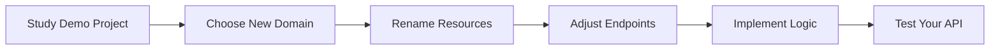

<p align="right"><a href="#top">↑ Back to top</a></p>

---

<a id="section-12"></a>

## 12) Step 9 — Analyze the Front-End of the Demo Project

Study the demo project:

[demo_api_1_simple_fastapi_app](https://github.com/inskillflow/demo_api_1_simple_fastapi_app)

Then review the front-end file:

[frontend.py](https://github.com/inskillflow/demo_api_1_simple_fastapi_app/blob/main/frontend.py)

This part helps you understand how a front-end can interact with a FastAPI backend and prepares you for the next evaluation.

### Front-End / Back-End Interaction

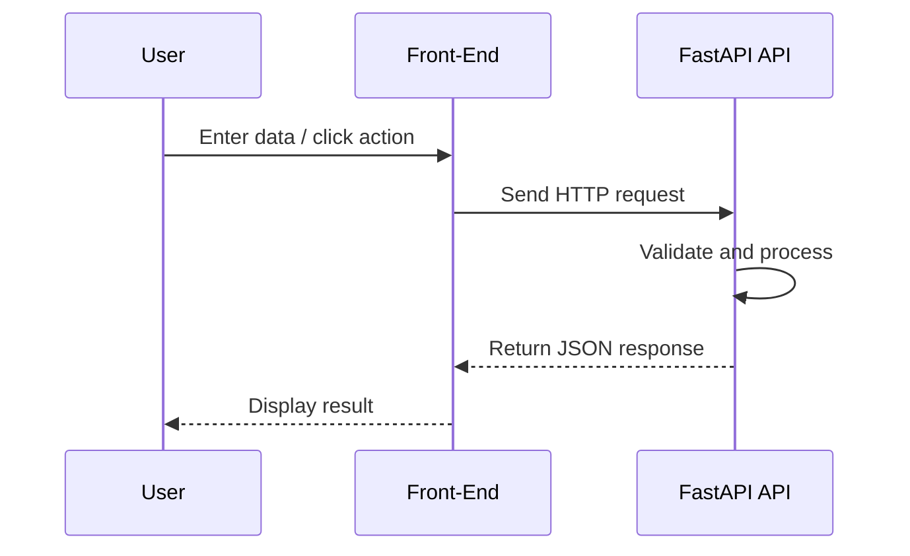

<p align="right"><a href="#top">↑ Back to top</a></p>

---

<a id="section-13"></a>

## 13) Step 10 — Evaluation 3: Build the Front-End for Your API

After building your API, your next task is to build its front-end.

Assignment:

[18 — FastAPI Evaluation 2: Build a Complete REST API](https://github.com/inskillflow/FastAPI-EN/blob/main/18-FastAPI-Evaluation-2-Build-a-Complete-REST-API.md)

### Project inspiration

Use the class project as a reference:

* [Demo project](https://github.com/inskillflow/demo_api_1_simple_fastapi_app)
* [frontend.py](https://github.com/inskillflow/demo_api_1_simple_fastapi_app/blob/main/frontend.py)

> [!IMPORTANT]
> Reuse what you already understand.
> Build with intention.
> Keep the structure clean, readable, and consistent with the backend you created.

### Full Stack Progression

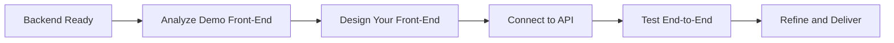

<p align="right"><a href="#top">↑ Back to top</a></p>

---

<a id="section-14"></a>

## 14) Step 11 — Next Project

After completing the previous stages, continue with the next project:

[iris-ai-platform](https://github.com/inskillflow/iris-ai-platform)

This project represents the next level after the FastAPI practice and evaluation sequence above.

<p align="right"><a href="#top">↑ Back to top</a></p>

---

<a id="section-15"></a>

## 15) Evaluations Overview

| Evaluation   | Title               | Format  | Main Objective                                           |
| ------------ | ------------------- | ------- | -------------------------------------------------------- |
| Evaluation 1 | API Testing Quiz    | Quiz    | Understand how to test an API correctly                  |
| Evaluation 2 | Build Your Own API  | Project | Develop a personal FastAPI backend inspired by the demo  |
| Evaluation 3 | Build the Front-End | Project | Create a front-end for the API developed in Evaluation 2 |

### Evaluation Flow

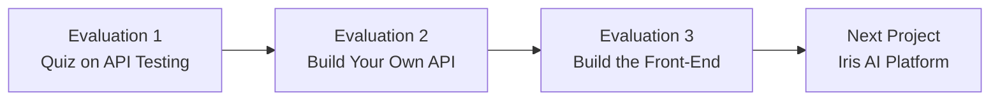

### Evaluation Logic

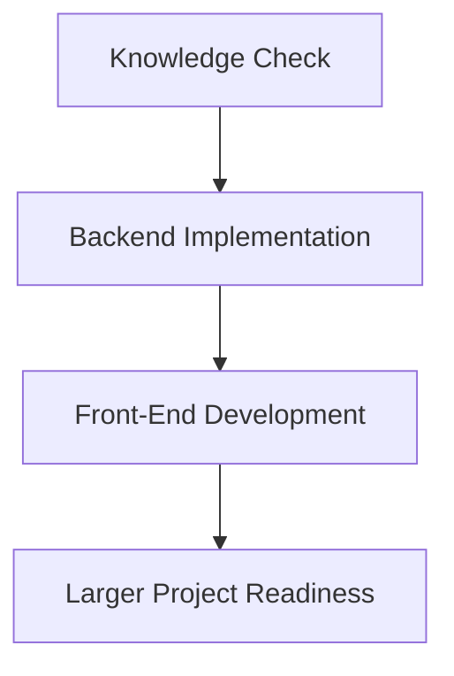

<p align="right"><a href="#top">↑ Back to top</a></p>

---

<a id="section-16"></a>

## 16) Recommended Workflow

A recommended order of work is the following:

1. Visit the main repository
   [FastAPI-EN](https://github.com/inskillflow/FastAPI-EN)

2. Understand FastAPI
   [00 — What is FastAPI](https://github.com/inskillflow/FastAPI-EN/blob/main/00-What-is-FastAPI.md)

3. Review the simple calculator example
   [01 — FastAPI Calculator API with Swagger UI](https://github.com/inskillflow/FastAPI-EN/blob/main/01-FastAPI-Calculator-API-with-Swagger-UI.md)

4. Read the main conceptual document
   [05 — FastAPI APIs: From Concepts to Implementation](https://github.com/inskillflow/FastAPI-EN/blob/main/05-FastAPI-APIs-From-Concepts-to-Implementation.md)

5. Learn API testing
   [06 — Practical Testing Guide](https://github.com/inskillflow/FastAPI-EN/blob/main/06-FastAPI-Method-1-Swagger-UI-REST-Client-Practical-Testing-Guide.md)

6. Complete the quiz
   [01 — Quiz](https://github.com/inskillflow/demo_api_1_simple_fastapi_app/blob/main/01-Quiz-API-Testing-with-FastAPI.md)

7. Review the answer key
   [02 — Answers](https://github.com/inskillflow/demo_api_1_simple_fastapi_app/blob/main/02-Answers-Quiz-API-Testing-with-FastAPI.md)

8. Understand `main.py` in detail
   [16 — main.py explained](https://github.com/inskillflow/FastAPI-EN/blob/main/16-FastAPI-main-py-Explained-Line-by-Line.md)

9. Build your own API
   [Demo project](https://github.com/inskillflow/demo_api_1_simple_fastapi_app/tree/main)

10. Analyze the front-end
    [frontend.py](https://github.com/inskillflow/demo_api_1_simple_fastapi_app/blob/main/frontend.py)

11. Build the front-end for your own API
    [Evaluation instructions](https://github.com/inskillflow/FastAPI-EN/blob/main/18-FastAPI-Evaluation-2-Build-a-Complete-REST-API.md)

12. Continue with the next project
    [iris-ai-platform](https://github.com/inskillflow/iris-ai-platform)

<p align="right"><a href="#top">↑ Back to top</a></p>

---

<a id="section-17"></a>

## 17) Visual Roadmap

### End-to-End Journey

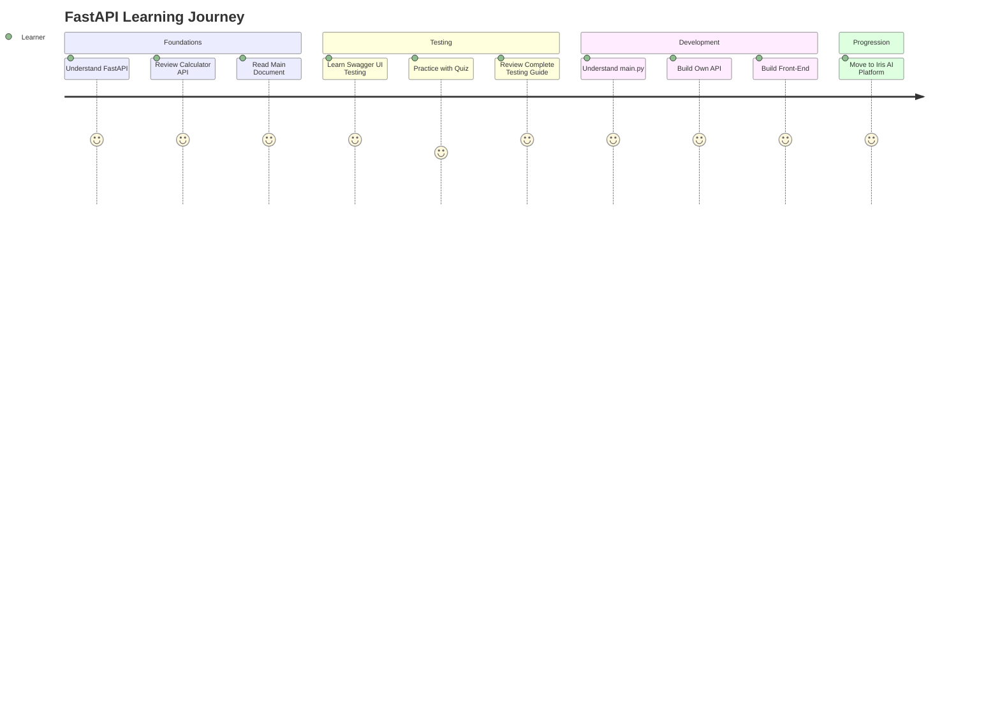

### Project Delivery Map

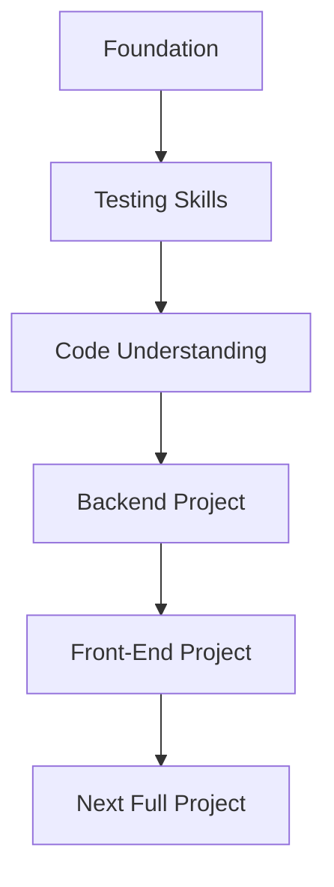

<p align="right"><a href="#top">↑ Back to top</a></p>

---

<a id="section-18"></a>

## 18) Conclusion

This roadmap is designed to give you a complete progression:

* understand FastAPI,
* explore a working example,
* learn how to test correctly,
* validate your understanding with a quiz,
* build your own API,
* develop its front-end,
* and continue toward a larger project.

The logic is simple: **learn, analyze, test, build, extend**.

> [!IMPORTANT]
> Recommended strategy:
>
> 1. Read the main materials in order.
> 2. Study the demo project carefully.
> 3. Build your own API by adaptation, not by improvisation.
> 4. Reuse the front-end patterns already analyzed.
> 5. Move to the next project only after completing the full sequence.

<p align="right"><a href="#top">↑ Back to top</a></p>

