> [!TIP]
> **Figure 1 — Global Learning Flow**  
> Shows the complete progression from FastAPI fundamentals to the final project transition.

```mermaid
flowchart TD
    A["Understand FastAPI"] --> B["Study a Simple Example"]
    B --> C["Read the Main Document"]
    C --> D["Learn API Testing"]
    D --> E["Practice with Quiz"]
    E --> F["Understand main.py"]
    F --> G["Build Your Own API"]
    G --> H["Build the Front-End"]
    H --> I["Continue to Iris AI Platform"]
````

> [!TIP]
> **Figure 2 — Recommended Mindset**
> Summarizes the ideal working approach: read, understand, analyze, adapt, build, test, and deliver.

```mermaid id="028z78"
flowchart TD
    A["Read"] --> B["Understand"]
    B --> C["Analyze"]
    C --> D["Reuse Patterns"]
    D --> E["Adapt"]
    E --> F["Build"]
    F --> G["Test"]
    G --> H["Deliver"]
```

> [!TIP]
> **Figure 3 — Core Idea of FastAPI**
> Illustrates how FastAPI receives a request, validates data, executes logic, and returns a JSON response while generating Swagger documentation.

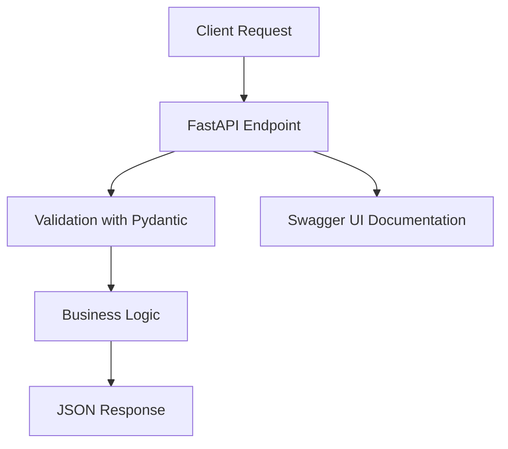

> [!TIP]
> **Figure 4 — Simple Example Architecture**
> Presents the structure of the calculator example and the relationship between the client, Swagger UI, endpoints, and responses.

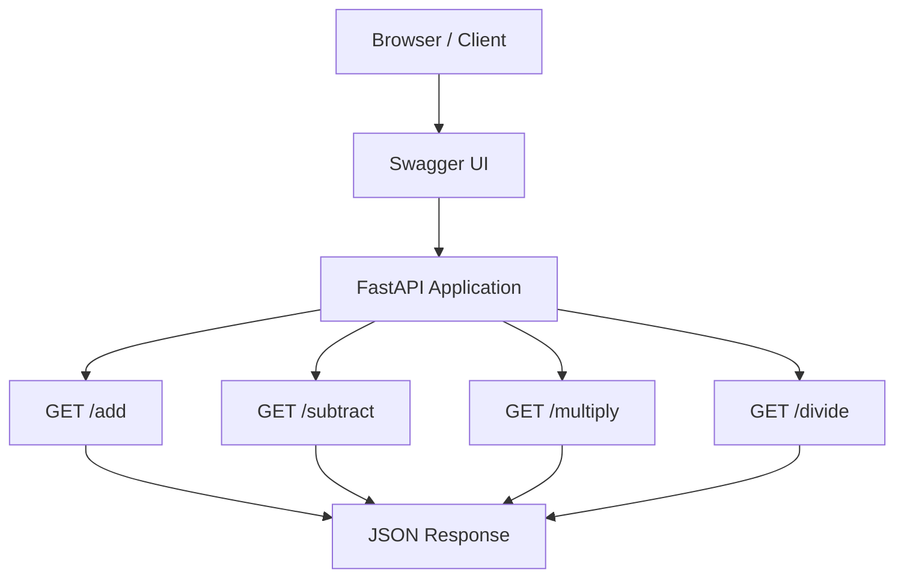

> [!TIP]
> **Figure 5 — From Theory to Practice**
> Shows the progression from conceptual understanding to implementation and hands-on project work.

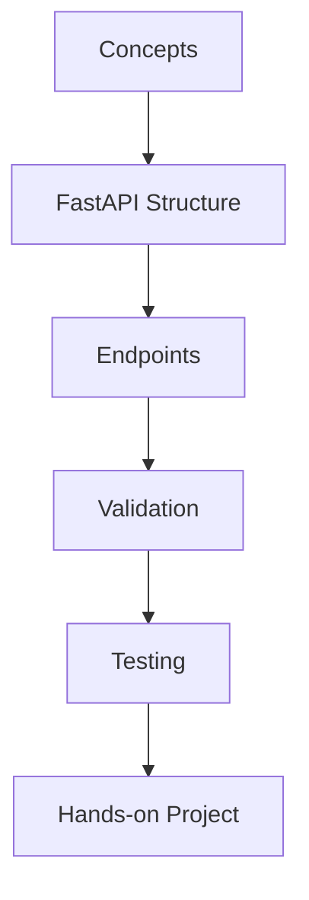

> [!TIP]
> **Figure 6 — Swagger UI Testing Flow**
> Describes the step-by-step process for testing an endpoint directly from the Swagger interface.

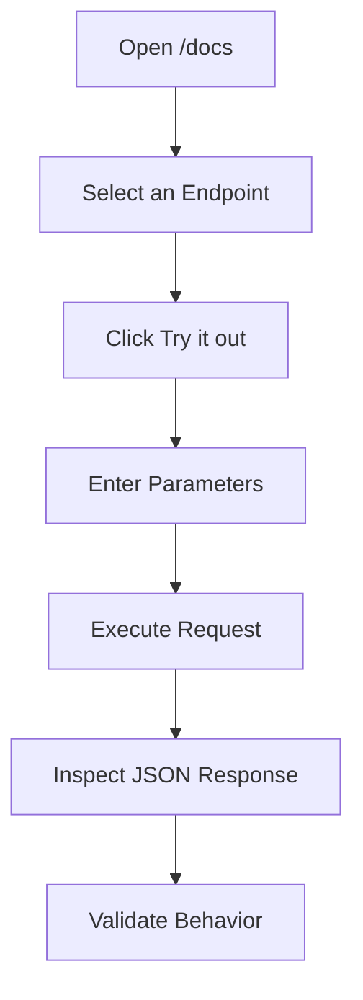

> [!TIP]
> **Figure 7 — API Testing Ecosystem**
> Compares the main testing options available for interacting with a FastAPI application.

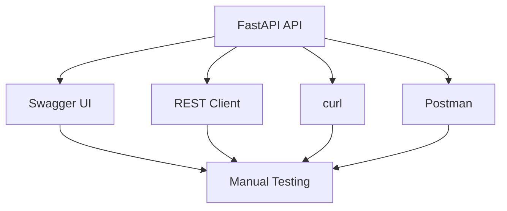

> [!TIP]
> **Figure 8 — Internal Structure of a FastAPI App**
> Highlights the main building blocks of a FastAPI project, including routes, models, validation, and business logic.

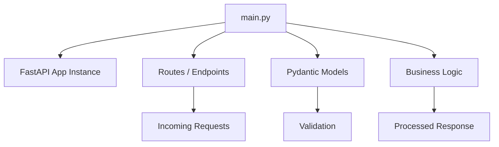

> [!TIP]
> **Figure 9 — Build Strategy**
> Explains a practical strategy for creating a personal API by adapting the demo project instead of starting from zero.

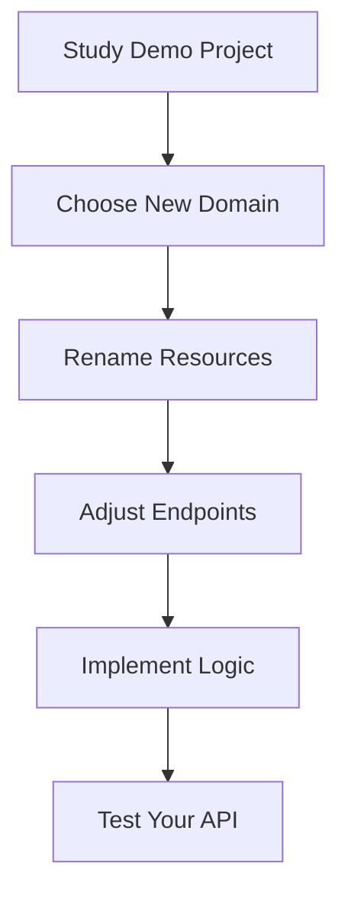

> [!TIP]
> **Figure 10 — Front-End / Back-End Interaction**
> Shows how the user, front-end, and FastAPI backend communicate during a typical request-response cycle.

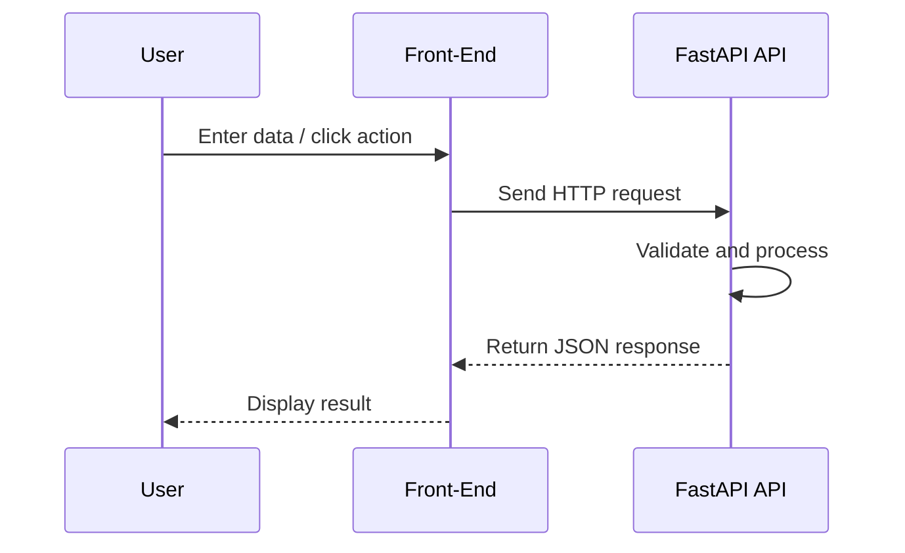

> [!TIP]
> **Figure 11 — Full Stack Progression**
> Summarizes the path from a completed backend to a connected, tested, and refined front-end.

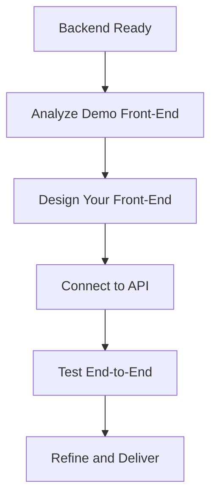

> [!TIP]
> **Figure 12 — Evaluation Flow**
> Presents the order of the three evaluations and the transition to the next project.

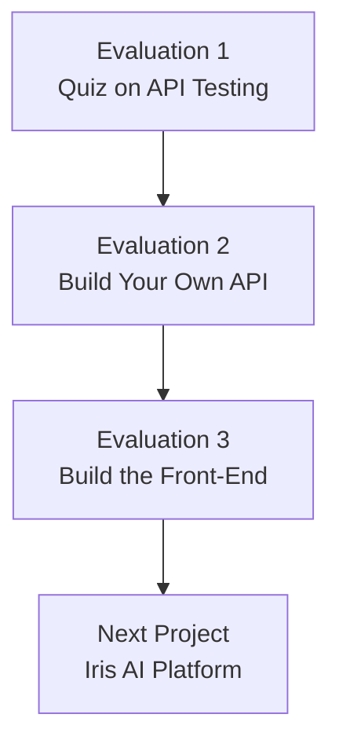

> [!TIP]
> **Figure 13 — Evaluation Logic**
> Explains how the evaluations move from knowledge verification to backend implementation and then to full project readiness.

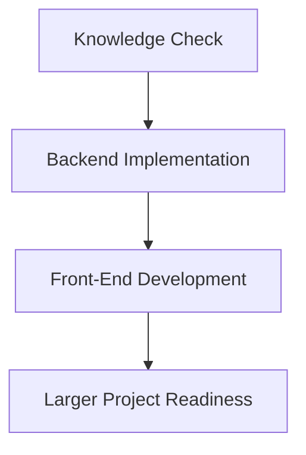

> [!TIP]
> **Figure 14 — FastAPI Learning Journey**
> Visualizes the learner’s progression across foundations, testing, development, and next-stage practice.

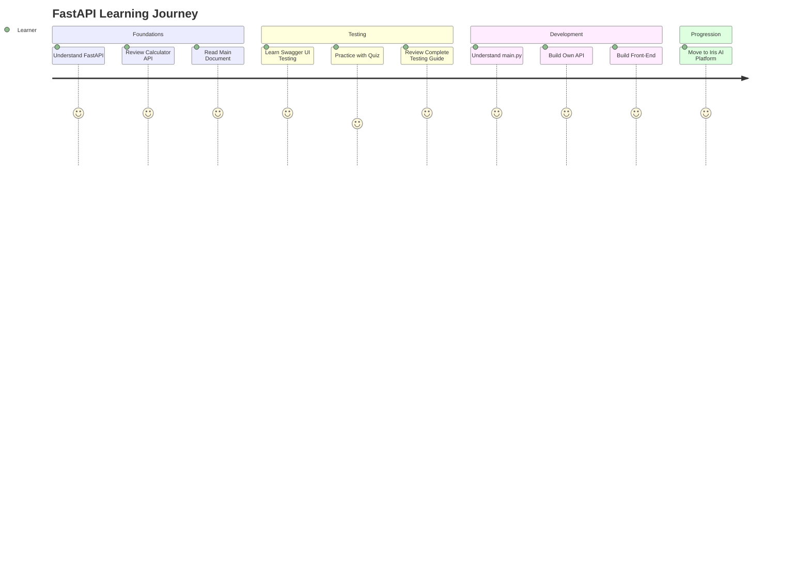

> [!TIP]
> **Figure 15 — Project Delivery Map**
> Provides a compact summary of the path from foundation to the next complete project.

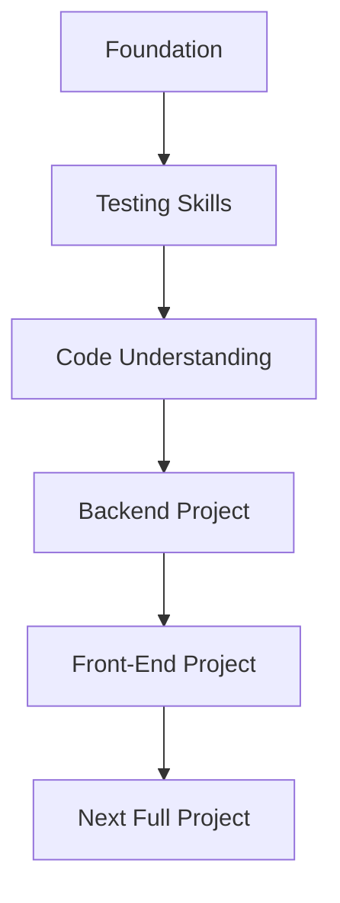
