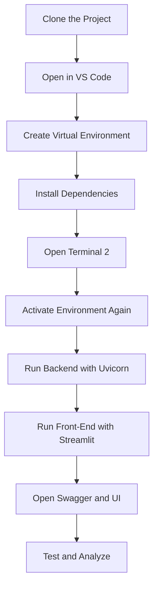
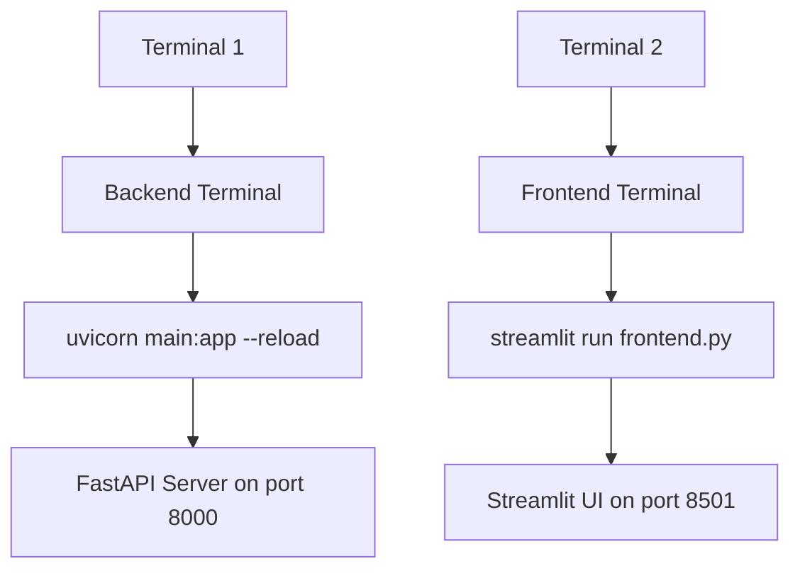
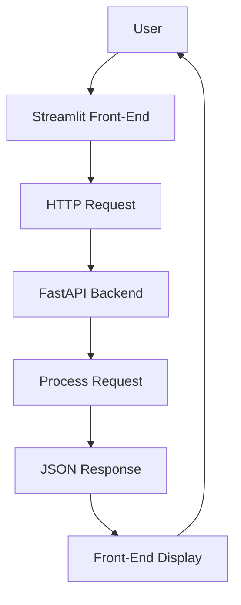
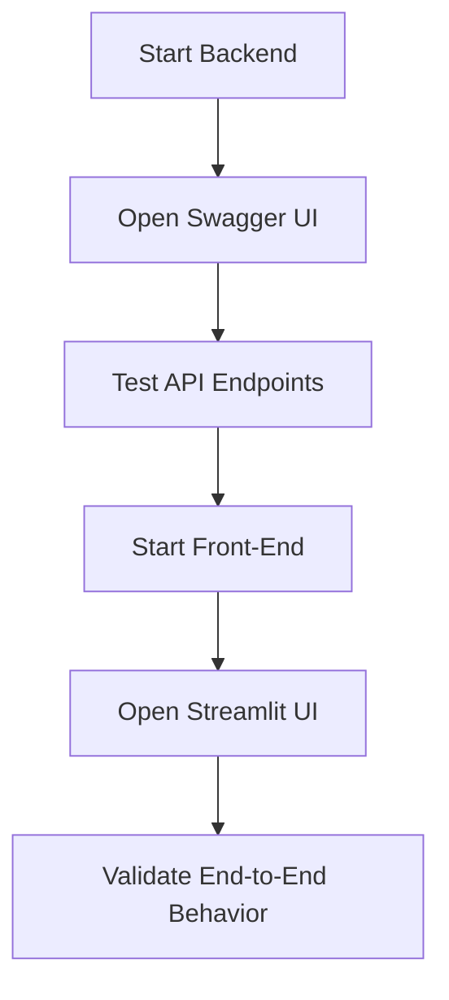

<a id="top"></a>

# FastAPI — Local Setup, Commands, and Run Guide

<p align="center">
  
  
  
</p>

<p align="center">
  A practical command guide to clone, configure, and run the FastAPI demo project locally with separate backend and frontend terminals.
</p>

---

## Table of Contents

| #   | Section                                                                 |
| --- | ----------------------------------------------------------------------- |
| 1   | [Objective](#section-1)                                                 |
| 2   | [Project Repository](#section-2)                                        |
| 3   | [Step 1 — Clone the Project](#section-3)                                |
| 4   | [Step 2 — Create the Virtual Environment](#section-4)                   |
| 5   | [Step 3 — Open the Second Terminal](#section-5)                         |
| 6   | [Step 4 — Terminal Naming Convention](#section-6)                       |
| 7   | [Step 5 — Run the Backend](#section-7)                                  |
| 8   | [Step 6 — Run the Front-End](#section-8)                                |
| 9   | [Step 7 — Test the Application](#section-9)                             |
| 10  | [Step 8 — Analyze `frontend.py`](#section-10)                           |
| 11  | [Step 9 — Next Evaluation](#section-11)                                 |
| 12  | [Quick Command Reference](#section-12)                                  |
| 13  | [Visual Workflow](#section-13)                                          |
| 14  | [Conclusion](#section-14)                                               |

---

<a id="section-1"></a>

## 1) Objective

This demo shows how to:

- clone a FastAPI project locally,
- configure the environment,
- install dependencies,
- run the backend,
- run the frontend,
- and test the application through the browser.

> [!IMPORTANT]
> From this point onward, use **two separate terminals**:
> - **Terminal 1** = backend terminal
> - **Terminal 2** = frontend terminal

<p align="right"><a href="#top">↑ Back to top</a></p>

---

<a id="section-2"></a>

## 2) Project Repository

Main learning repository:

[FastAPI-EN](https://github.com/inskillflow/FastAPI-EN/tree/main)

Demo project used in this local setup:

[demo_api_1_simple_fastapi_app](https://github.com/inskillflow/demo_api_1_simple_fastapi_app)

<p align="right"><a href="#top">↑ Back to top</a></p>

---

<a id="section-3"></a>

## 3) Step 1 — Clone the Project

Open a terminal and run the following commands:

```bat
cd C:\Users\%USERNAME%\Downloads
mkdir application1
cd application1
git clone https://github.com/inskillflow/demo_api_1_simple_fastapi_app.git .
code .
````

### Explanation

* `cd C:\Users\%USERNAME%\Downloads` moves to the Downloads folder.
* `mkdir application1` creates a new project folder.
* `cd application1` enters the folder.
* `git clone ... .` clones the repository directly into the current folder.
* `code .` opens the project in Visual Studio Code.

> [!TIP]
> The dot `.` at the end of the `git clone` command means:
> **clone the repository into the current folder**.

<p align="right"><a href="#top">↑ Back to top</a></p>

---

<a id="section-4"></a>

## 4) Step 2 — Create the Virtual Environment

Now open a new terminal in VS Code.

---

### Open a New Terminal — Terminal 1

Use this terminal as the **backend terminal**.

```bat
python3 --version
python3 -m venv myapp1
.\myapp1\Scripts\activate
python --version
pip install -r requirements.txt
pip list
```

### What these commands do

* `python3 --version` checks whether Python is installed and available.
* `python3 -m venv myapp1` creates a virtual environment named `myapp1`.
* `.\myapp1\Scripts\activate` activates the virtual environment on Windows.
* `python --version` verifies the active Python interpreter.
* `pip install -r requirements.txt` installs the project dependencies.
* `pip list` shows the installed packages.

> [!NOTE]
> Once the environment is activated, your terminal usually displays something like:
>
> ```text
> (myapp1)
> ```

<p align="right"><a href="#top">↑ Back to top</a></p>

---

<a id="section-5"></a>

## 5) Step 3 — Open the Second Terminal

Open another terminal in VS Code.

---

### Open a New Terminal — Terminal 2

Use this terminal as the **frontend terminal**.

```bat
cd C:\Users\%USERNAME%\Downloads\application1
.\myapp1\Scripts\activate
```

### Why this is needed

The frontend must run in a separate terminal because:

* the backend server keeps running continuously,
* the frontend application also keeps running continuously,
* and both processes must stay active at the same time.

<p align="right"><a href="#top">↑ Back to top</a></p>

---

<a id="section-6"></a>

## 6) Step 4 — Terminal Naming Convention

From now on:

* **Terminal 1** = **backend terminal**
* **Terminal 2** = **frontend terminal**

> [!IMPORTANT]
> Keep both terminals open during development and testing.

<p align="right"><a href="#top">↑ Back to top</a></p>

---

<a id="section-7"></a>

## 7) Step 5 — Run the Backend

Go to **Terminal 1** and run:

```bat
uvicorn main:app --reload
```

### Important note

Do **not** run:

```bat
python main.py
```

### Why `uvicorn main:app --reload`?

* `uvicorn` starts the FastAPI server properly.
* `main:app` means:

  * `main` = the Python file `main.py`
  * `app` = the FastAPI application object inside that file
* `--reload` automatically restarts the server when the code changes.

<p align="right"><a href="#top">↑ Back to top</a></p>

---

<a id="section-8"></a>

## 8) Step 6 — Run the Front-End

Go to **Terminal 2** and run one of the following commands:

```bat
streamlit run frontend.py
```

or

```bat
python -m streamlit run frontend.py
```

### Front-end URL

After launching the interface, open:

[http://localhost:8501/](http://localhost:8501/)

### Why two possible commands?

Both commands start the Streamlit application.
The second version can be useful when calling Streamlit through the current Python interpreter explicitly.

<p align="right"><a href="#top">↑ Back to top</a></p>

---

<a id="section-9"></a>

## 9) Step 7 — Test the Application

Once both terminals are running, use the following URLs:

* Home page: [http://127.0.0.1:8000/](http://127.0.0.1:8000/)
* Tasks endpoint: [http://127.0.0.1:8000/tasks](http://127.0.0.1:8000/tasks)
* Swagger documentation: [http://127.0.0.1:8000/docs](http://127.0.0.1:8000/docs)
* ReDoc documentation: [http://127.0.0.1:8000/redoc](http://127.0.0.1:8000/redoc)
* Front-end UI: [http://localhost:8501/](http://localhost:8501/)

### Recommended testing order

1. Check that the backend is running.
2. Open Swagger UI.
3. Test the endpoints.
4. Open the Streamlit interface.
5. Verify that the frontend communicates correctly with the backend.

<p align="right"><a href="#top">↑ Back to top</a></p>

---

<a id="section-10"></a>

## 10) Step 8 — Analyze `frontend.py`

Next step:

* analyze the file `frontend.py`,
* understand how the interface is built,
* identify how it sends requests to the FastAPI backend,
* and observe how results are displayed to the user.

Reference file:

[frontend.py](https://github.com/inskillflow/demo_api_1_simple_fastapi_app/blob/main/frontend.py)

> [!TIP]
> Focus on the interaction between:
>
> * user input,
> * request sending,
> * backend response,
> * and UI rendering.

<p align="right"><a href="#top">↑ Back to top</a></p>

---

<a id="section-11"></a>

## 11) Step 9 — Next Evaluation

Next task:

**Do Evaluation 2 — create the UI for your own API.**

The idea is to use the demo project as a reference and then build a similar interface for the API you created yourself.

> [!IMPORTANT]
> Reuse the structure intelligently.
> Do not waste time rebuilding everything from zero when a solid example already exists.

<p align="right"><a href="#top">↑ Back to top</a></p>

---

<a id="section-12"></a>

## 12) Quick Command Reference

### Project setup

```bat
cd C:\Users\%USERNAME%\Downloads
mkdir application1
cd application1
git clone https://github.com/inskillflow/demo_api_1_simple_fastapi_app.git .
code .
```

### Terminal 1 — backend setup

```bat
python3 --version
python3 -m venv myapp1
.\myapp1\Scripts\activate
python --version
pip install -r requirements.txt
pip list
```

### Terminal 2 — frontend setup

```bat
cd C:\Users\%USERNAME%\Downloads\application1
.\myapp1\Scripts\activate
```

### Run backend

```bat
uvicorn main:app --reload
```

### Run frontend

```bat
streamlit run frontend.py
```

or

```bat
python -m streamlit run frontend.py
```

<p align="right"><a href="#top">↑ Back to top</a></p>

---

<a id="section-13"></a>

## 13) Visual Workflow

> [!TIP]
> **Figure 1 — Local Setup Workflow**
> Shows the overall progression from cloning the project to running both backend and frontend locally.



> [!TIP]
> **Figure 2 — Two-Terminal Architecture**
> Illustrates the role of the backend terminal and the frontend terminal during local execution.



> [!TIP]
> **Figure 3 — Request Flow Between UI and API**
> Shows how the user interacts with the frontend, which then communicates with the FastAPI backend.



> [!TIP]
> **Figure 4 — Recommended Testing Sequence**
> Presents the preferred order for validating the local application after launch.



<p align="right"><a href="#top">↑ Back to top</a></p>

---

<a id="section-14"></a>

## 14) Conclusion

This guide provides a complete local execution workflow for the FastAPI demo project:

* clone the project,
* configure the environment,
* use two terminals,
* run the backend correctly,
* run the frontend correctly,
* test the application,
* analyze the UI code,
* and prepare for the next evaluation.

The logic is simple:

**clone, configure, run, test, analyze, extend.**

<p align="right"><a href="#top">↑ Back to top</a></p>

